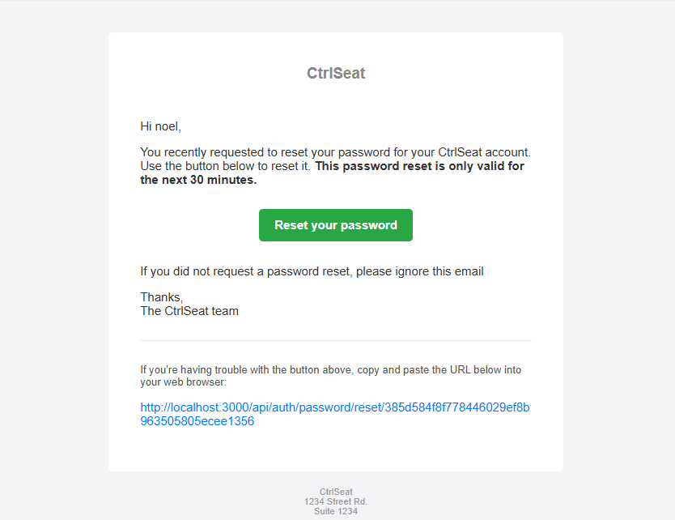
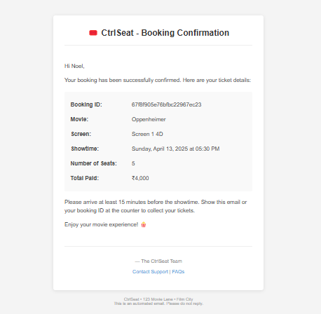

# 🎟️ CtrlSeat – Movie Ticket Booking API

CtrlSeat is a Node.js and Express-based backend API designed for seamless movie ticket booking. It integrates Razorpay for secure payments and utilizes Mailtrap for testing email confirmations.

---

## 🚀 Live Demo

Experience CtrlSeat in action:   [https://ctrlseat.onrender.com](https://ctrlseat.onrender.com)


---

## 🚀 Features

- **User Authentication**: Secure registration and login using JWT.
- **Movie & Show Management**: CRUD operations for movies and their respective shows.
- **Seat Booking**: Real-time seat selection and booking capabilities.
- **Payment Integration**: Razorpay integration for handling payments.
- **Email Notifications**: Booking confirmation emails sent via Mailtrap.
- **Admin Dashboard**: Manage movies, shows, and bookings with ease.

---

## 📧 Email Templates

### Password Reset Email


*Email template sent to users when they request on forgot password.*

### Booking Confirmation Receipt


*Email receipt sent to users after successful movie ticket booking.*

---

## 🛠️ Tech Stack

- **Backend**: Node.js, Express.js
- **Database**: MongoDB with Mongoose
- **Authentication**: JSON Web Tokens (JWT)
- **Payment Gateway**: Razorpay
- **Email Service**: Mailtrap, Nodemailer
- **Environment Management**: dotenv

---

## 📂 Project Structure

```
CtrlSeat/
├── backend/
│   ├── config/           # Configuration files (e.g., database, environment)
│   ├── controllers/      # Route handler functions
│   ├── middlewares/      # Custom middleware (e.g., authentication, error handling)
│   ├── models/           # Mongoose schemas and models
│   ├── routes/           # Express route definitions
│   ├── seeder/           # Database seeding scripts
│   ├── utils/            # Utility functions and helpers
│   └── app.js            # Main application entry point
├── node_modules/         # Project dependencies
├── .gitignore            # Specifies files to be ignored by Git
├── config.env.example    # Sample environment variables file
├── package.json          # Project metadata and dependencies
├── package-lock.json     # Exact versions of installed dependencies
├── README.md             # Project documentation
└── ...
```

---

## ⚙️ Setup & Installation

1. **Clone the Repository**:
   ```bash
   git clone git@github.com:nkj2800/CtrlSeat.git
   cd CtrlSeat
   ```

2. **Install Dependencies**:
   ```bash
   npm install
   ```

3. **Configure Environment Variables**:
   - Rename `config.env.example` to `config.env`.
   - Fill in the required environment variables:
    
    
     ```env
      Server
        PORT=3000
        NODE_ENV=DEVELOPMENT

      Database
        DB_LOCAL_URI=mongodb://localhost:27017/ctrlseat
        DB_URI=your_production_mongo_uri_here

      JWT Config
        JWT_SECRET=your_jwt_secret
        JWT_EXPIRES_IN=7d
        COOKIE_EXPIRES_IN=7

      Mailtrap SMTP (for testing emails)
        SMTP_HOST=sandbox.smtp.mailtrap.io
        SMTP_PORT=your_smtp_port
        SMTP_EMAIL=your_mailtrap_username
        SMTP_PASSWORD=your_mailtrap_password
        SMTP_FROM_EMAIL=noreply@ctrlseat.com
        SMTP_FROM_NAME=CtrlSeat

      Razorpay
        RAZORPAY_KEY_ID=your_razorpay_key_id
        RAZORPAY_KEY_SECRET=your_razorpay_key_secret
     ```
4. **Seed the Database (Optional)**:
   - If you want to insert sample movies into the database, run the movie seeder:
   ```bash
   npm run seeder
   ```
   - This will populate the `movies` collection with sample data.

5. **Start the Server**:
   ```bash
   npm start
   ```

---

## 📬 API Documentation

### Postman Collection

To help you test and explore the CtrlSeat API, we've prepared a comprehensive Postman collection.

#### Option 1: Import from Repository
You can find our Postman collection file in the `/docs/postman` directory of this repository.

#### Option 2: Import via Link
[](https://documenter.getpostman.com/view/30023998/2sB2cd5dzx)


Each request includes necessary headers, body parameters, and example responses to get you started quickly.

---

## 🧪 Testing

- **Email Testing**: All transactional emails are routed through Mailtrap for safe testing.
- **Payment Testing**: Utilize Razorpay's test mode to simulate payment scenarios.

---

## 🛡️ Deployment

Deploy the application seamlessly on platforms like Render:

1. **Set Up Environment Variables**: Ensure all variables from `config.env` are set in the platform's dashboard.
2. **Build & Deploy**: Follow the platform-specific instructions to build and deploy the application.

---

## 🤝 Contributing

Contributions are welcome! Please fork the repository and submit a pull request for any enhancements or bug fixes.

---

## 📄 License

This project is licensed under the [MIT License](LICENSE).

---

## 📧 Contact

For any queries or support, please contact [nkj2800off@gmail.com](mailto:nkj2800off@gmail.com).
